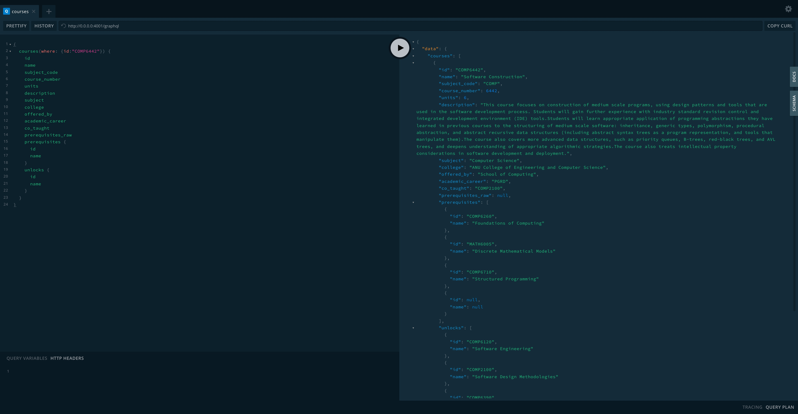
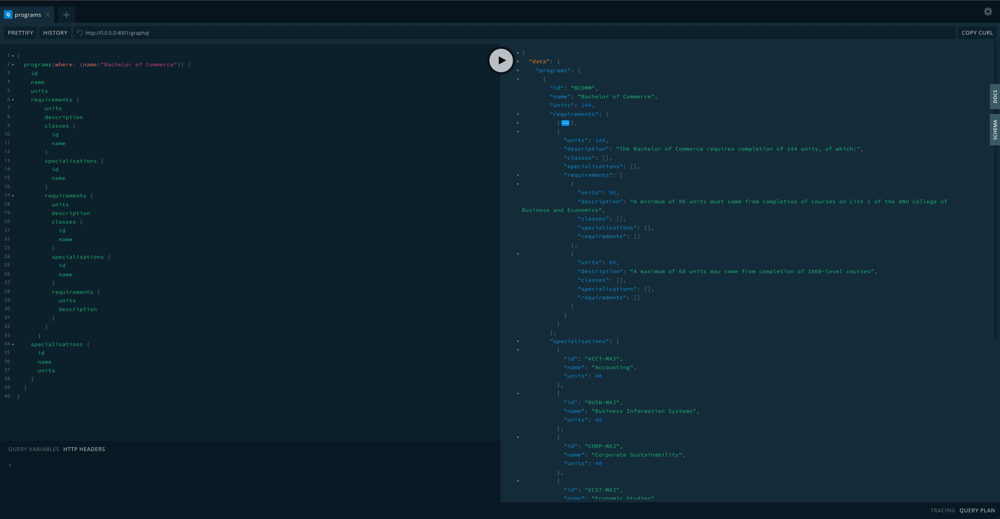

# ANU Programs and Courses Graph API (Unofficial)

Graph API Endpoint / GraphQL Playground [Link](http://ec2-3-26-165-14.ap-southeast-2.compute.amazonaws.com/graphql)

See [this file](src/query.graphql) for sample queries.

## Quick Start

```
ssh -i anugraph.pem ubuntu@ec2-xxxxxxxxxx.ap-southeast-2.compute.amazonaws.com
git clone https://github.com/from81/ANU-GraphQL.git
cd ANU-GraphQL
./setup.sh
```

This will start the GraphQL service (by default on localhost:4000) where you can issue GraphQL requests or access GraphQL Playground in the browser:




To test the Graph API,

```
curl -G --url '<URL>' -H 'Accept-Encoding: gzip, deflate, br' -H 'Content-Type: application/json' -H 'Accept: application/json' --data-urlencode 'query={ courses(where: {id:"COMP2100"}) { id name subject_code course_number units description subject college offered_by academic_career co_taught prerequisites_raw prerequisites { id name } unlocks { id name } } }'
```

## Configure

Set your Neo4j connection string and credentials in `.env`. For example:

_.env_

```
NEO4J_URI=bolt://localhost:7687
NEO4J_USER=neo4j
NEO4J_PASSWORD=letmein
AUTH_DIRECTIVES_ROLE_KEY=https://<auth0domain_OR_Custom_Auth_Doamin>/role
JWT_SECRET="-----BEGIN PUBLIC KEY-----<ACTUAL_PUBLIC_KEY_CONTENT_WITH_CRLF>-----END PUBLIC KEY-----"
```